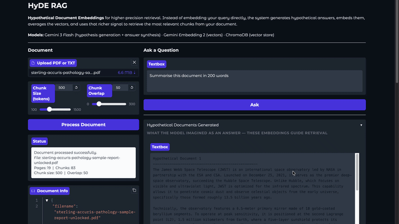

# HyDE RAG

> A retrieval-augmented generation pipeline that applies Hypothetical Document Embeddings (HyDE) to improve retrieval quality over standard query-embedding approaches.


## Overview

Standard RAG embeds the user's raw query and uses it to search the vector store. The problem: a short question and a long detailed answer live in very different regions of the embedding space, so the nearest-neighbour search often misses the most relevant chunks.

HyDE solves this by flipping the retrieval signal. Instead of embedding the query, the system prompts an LLM to generate N hypothetical answers, documents that *would* contain the answer. Each is embedded, the resulting vectors are averaged into a single HyDE embedding, and that richer signal is used to retrieve from the vector store. Hypothetical answers sit much closer to real answers in embedding space than the original query does.

## Demo



## Features

- **Hypothetical Document Generation:** Gemini 3 Flash generates N configurable hypothetical answer documents per query
- **HyDE Averaging:** Gemini Embedding 2 embeds each hypothetical doc; vectors are averaged with NumPy into a single retrieval signal
- **ChromaDB Vector Store:** Lightweight, in-process vector store that requires no external service
- **Transparent Intermediate Steps:** The UI surfaces the hypothetical documents and retrieved chunks so you can see exactly how retrieval worked
- **Configurable Retrieval:** Sliders for chunk size, chunk overlap, number of hypothetical docs, and number of retrieved chunks
- **PDF and TXT support:** LangChain document loaders handle both formats
- **Clean Gradio UI:** Two-column layout with document management on the left and the query pipeline on the right

## Tech Stack

| Layer | Technology |
|---|---|
| Hypothesis generation + Answer synthesis | Gemini 3 Flash (`gemini-3-flash-preview`) via Google GenAI SDK |
| Embeddings | Gemini Embedding 2 (`gemini-embedding-2`) via Google GenAI SDK |
| Vector store | ChromaDB (in-process) |
| Document loading + chunking | LangChain Community + LangChain Text Splitters |
| UI | Gradio |

## Prerequisites

- Python 3.11 or later
- A Google API key, get one free at [aistudio.google.com](https://aistudio.google.com)

## Installation

**Clone the repository**

```bash
git clone https://github.com/muhammadhussain-2009/Open-Source-LLM-Projects.git
cd Open-Source-LLM-Projects/HyDE RAG
```

**Create and activate a virtual environment**

*macOS / Linux*
```bash
python -m venv .venv
source .venv/bin/activate
```

*Windows*
```bash
python -m venv .venv
.venv\Scripts\activate
```

**Install dependencies**

```bash
pip install .
```

Or with `uv`:

```bash
uv sync
```

**Set up environment variables**

```bash
cp .env.example .env
```

Open `.env` and add your API keys.

## Usage

```bash
python app.py
```

Open `http://127.0.0.1:7860` in your browser.

**Example workflow**

1. Paste your API keys in the left panel (or set them in `.env`)
2. Upload a PDF or TXT document
3. Adjust chunk size and overlap if needed, then click **Process Document**
4. Type a question and click **Ask**
5. Watch the hypothetical documents, retrieved chunks, and final answer appear

## Environment Variables

| Variable | Description | Where to get it |
|---|---|---|
| `GOOGLE_API_KEY` | Authenticates Gemini 3 Flash and Gemini Embedding 2 requests | [aistudio.google.com](https://aistudio.google.com) |

## How It Works

```
User question
      │
      ▼
Gemini 3 Flash generates N hypothetical answer documents
      │
      ▼
Gemini Embedding 2 embeds each hypothetical document
      │
      ▼
NumPy averages the N vectors → single HyDE embedding
      │
      ▼
ChromaDB similarity search with HyDE embedding
      │
      ▼
Top-K chunks retrieved
      │
      ▼
Gemini 3 Flash synthesises final answer from retrieved context
```

## Project Structure

```text
hyde_rag/
├── app.py            # Gradio UI
├── rag.py            # HyDERAG class, ingest and query pipeline
├── embedder.py       # GeminiEmbedder, embedding + HyDE vector averaging
├── pyproject.toml    # Project dependencies
├── .env              # Your API keys (git-ignored)
├── .env.example      # Template for .env
└── assets/
    └── demo.gif
```

[Back to top](#hyde-rag)
