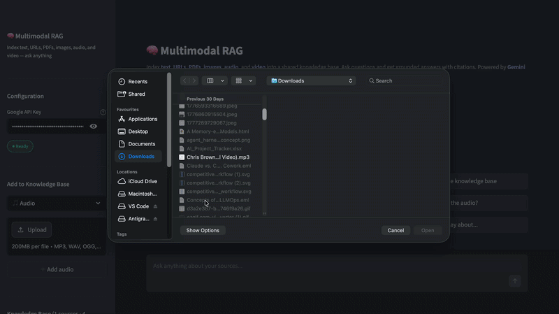

# Multimodal RAG

> A RAG system that ingests text, URLs, PDFs, images, audio, and video into a shared ChromaDB index and answers questions with grounded citations. For image, audio, and video sources, the original file is passed directly to Gemini 3 Flash at query time for truly multimodal answers.

## Demo



## Overview

Most RAG systems handle text only. This one accepts six source types in a unified pipeline. Add a research paper, a YouTube transcript, a photo, a voice note, and a product demo video, then ask a question that spans all of them. Gemini Embedding 2 retrieves the most relevant chunks, and Gemini 3 Flash generates a grounded answer, citing each source.

For media files (images, audio, video), Gemini first extracts a text description for indexing. At query time, if a media chunk is retrieved, the original file URI is passed back to Gemini 3 Flash alongside the text context, so the model sees the actual image, hears the audio, or watches the video rather than just reading a description.

## Features

- **Six source types:** Text, URL, PDF, image, audio, and video in a single knowledge base
- **Gemini File API integration:** Images, audio, and video are uploaded and processed natively
- **True multimodal generation:** Retrieved media files are passed directly to Gemini 3 Flash, not just their text descriptions
- **LangChain document processing:** PyPDFLoader for PDFs, RecursiveCharacterTextSplitter for chunking
- **Gemini Embedding 2:** Semantic similarity search across all source types
- **Source citations:** Every answer cites which source each piece of information came from

## Tech Stack

| Layer | Technology |
|---|---|
| LLM | Gemini 3 Flash (`gemini-3-flash-preview`) |
| Embeddings | Gemini Embedding 2 (`gemini-embedding-2`) |
| Agent orchestration | LangChain |
| Vector store | ChromaDB (in-memory) |
| File handling | Gemini File API (images, audio, video) |
| PDF loading | LangChain `PyPDFLoader` |
| UI | Streamlit |

## Prerequisites

- Python 3.10 or later
- [uv](https://docs.astral.sh/uv/) for dependency management
- A Google API key. Get one free at [aistudio.google.com](https://aistudio.google.com)

## Installation

```bash
git clone https://github.com/muhammadhussain-2009/Open-Source-LLM-Projects.git
cd Open-Source-LLM-Projects/Multimodal RAG
cp .env.example .env
```

Add your Google API key to `.env`.

Install dependencies:

```bash
uv add <dependency name>
uv sync

pip install -r requirements.txt 
```

## Usage

```bash
uv run streamlit run app.py
```

Open `http://localhost:8501`, enter your API key, and start adding sources from the sidebar.

## Supported Source Types

| Type | Formats | How it works |
|---|---|---|
| Text | Any plain text | Split and indexed directly |
| URL | Any public web page | Fetched, HTML stripped, indexed |
| PDF | `.pdf` | Loaded page by page via PyPDFLoader |
| Image | `.jpg`, `.png`, `.webp`, `.gif` | Uploaded to Gemini File API, described, indexed |
| Audio | `.mp3`, `.wav`, `.ogg`, `.m4a` | Uploaded to Gemini File API, transcribed, indexed |
| Video | `.mp4`, `.mov`, `.webm`, `.avi` | Uploaded to Gemini File API, described, indexed |

## Environment Variables

| Variable | Description |
|---|---|
| `GOOGLE_API_KEY` | Authenticates Gemini 3 Flash, Gemini Embedding 2, and Gemini File API |

## Project Structure

```text
multimodal_rag/
├── rag.py            # GeminiEmbeddings + MultimodalRAG class
├── app.py            # Streamlit UI
├── pyproject.toml
├── .env.example
└── assets/
    └── demo.gif
```

## How It Works

```
Add a source (text / URL / PDF / image / audio / video)
    │
    ├── Text/URL/PDF → chunk with RecursiveCharacterTextSplitter
    └── Image/Audio/Video → upload to Gemini File API → Gemini extracts description → chunk
    │
    ▼
Gemini Embedding 2 embeds each chunk
    │
    ▼
Stored in ChromaDB (with file URI metadata for media sources)
    │
    ▼
User asks a question
    │
    ▼
Gemini Embedding 2 embeds the question
    │
    ▼
ChromaDB returns top-k most similar chunks
    │
    ▼
Content parts assembled for Gemini 3 Flash:
  ├── Text chunks → passed as text parts
  └── Media chunks → original file URI passed as file parts (true multimodal)
    │
    ▼
Gemini 3 Flash generates a grounded answer with source citations
```

---

[Back to Top](#multimodal-rag)
